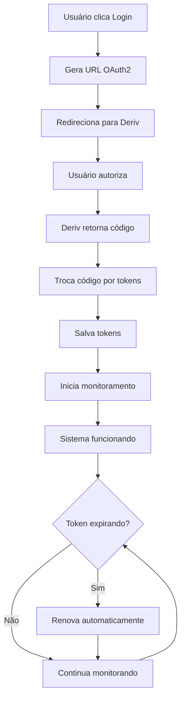

# 🔐 Guia do Sistema de Autenticação - Bot Trader Deriv

## 📋 Visão Geral

Este sistema implementa autenticação OAuth2 completa com a plataforma Deriv, incluindo:
- ✅ Login automático via OAuth2
- ✅ Gerenciamento automático de tokens
- ✅ Renovação automática de tokens
- ✅ Integração com coleta de dados e saldo
- ✅ Interface amigável no dashboard

## 🚀 Como Usar

### 1. Primeiro Acesso
1. Execute o dashboard: `python main.py --mode dashboard`
2. Acesse: http://localhost:8501
3. Vá para a aba **"🔐 Login"**
4. Clique em **"🚀 Fazer Login com Deriv"**
5. Autorize o aplicativo na página da Deriv
6. Você será redirecionado automaticamente

### 2. Após o Login
- ✅ Token será salvo automaticamente
- ✅ Monitoramento automático iniciado
- ✅ Coleta de dados habilitada
- ✅ Saldo atualizado em tempo real

## 🔧 Componentes do Sistema

### 📁 auth_manager.py
**Responsabilidades:**
- Gerenciar fluxo OAuth2 com Deriv
- Armazenar tokens de acesso e refresh
- Validar tokens existentes
- Renovar tokens expirados

**Métodos principais:**
```python
auth_manager.is_authenticated  # Verifica se está autenticado
auth_manager.get_api_token()   # Obtém token atual
auth_manager.refresh_token()   # Renova token manualmente
auth_manager.logout()          # Faz logout
```

### 📁 token_manager.py
**Responsabilidades:**
- Monitoramento automático de tokens
- Renovação automática antes do vencimento
- Notificação de renovações
- Status do gerenciamento

**Métodos principais:**
```python
token_manager.start_monitoring()  # Inicia monitoramento
token_manager.stop_monitoring()   # Para monitoramento
token_manager.get_status()        # Status atual
token_manager.force_renewal()     # Força renovação
```

### 📁 balance_manager.py
**Responsabilidades:**
- Atualização automática de saldo
- Integração com auth_manager
- Tratamento de erros de autenticação
- Status de conexão

**Melhorias implementadas:**
- ✅ Verificação automática de tokens
- ✅ Integração com auth_manager
- ✅ Mensagens de erro melhoradas

### 📁 data_collector.py
**Responsabilidades:**
- Coleta de dados em tempo real
- Uso automático de tokens OAuth
- Reconexão automática
- Tratamento de erros de API

## 🔄 Fluxo de Autenticação



## 🛠️ Configuração

### Variáveis de Ambiente (.env)
```env
# OAuth2 Deriv
DERIV_APP_ID=seu_app_id
DERIV_CLIENT_SECRET=seu_client_secret
DERIV_REDIRECT_URI=http://localhost:8501/auth/callback

# API Deriv (opcional - será substituído pelo OAuth)
DERIV_API_TOKEN=seu_token_manual
```

### Configuração no config.py
```python
# OAuth2 settings
DERIV_APP_ID = os.getenv('DERIV_APP_ID')
DERIV_CLIENT_SECRET = os.getenv('DERIV_CLIENT_SECRET')
DERIV_REDIRECT_URI = os.getenv('DERIV_REDIRECT_URI', 'http://localhost:8501/auth/callback')
```

## 🧪 Testes

Execute o teste completo do sistema:
```bash
python test_auth_flow.py
```

**Testes incluídos:**
- ✅ Auth Manager
- ✅ Token Manager  
- ✅ Data Collector
- ✅ Balance Manager
- ✅ Integração completa

## 📊 Monitoramento

### Dashboard - Aba Login
- 🟢 Status de autenticação
- 📊 Informações do usuário
- 🔄 Status do token manager
- ⚙️ Controles manuais

### Logs
```bash
# Logs do sistema
tail -f logs/bot.log

# Logs específicos de autenticação
grep "auth_manager\|token_manager" logs/bot.log
```

## 🔒 Segurança

### Boas Práticas Implementadas
- ✅ Tokens armazenados de forma segura
- ✅ Refresh tokens para renovação
- ✅ Validação de tokens antes do uso
- ✅ Logout seguro
- ✅ Tratamento de erros de autenticação

### Proteções
- 🛡️ Tokens não expostos em logs
- 🛡️ Verificação de validade automática
- 🛡️ Renovação antes do vencimento
- 🛡️ Fallback para configuração manual

## 🚨 Solução de Problemas

### Problema: "Token inválido"
**Solução:**
1. Vá para aba Login no dashboard
2. Clique em "🚀 Fazer Login com Deriv"
3. Reautorize o aplicativo

### Problema: "Erro de conexão"
**Solução:**
1. Verifique conexão com internet
2. Verifique se DERIV_APP_ID está correto
3. Verifique logs: `tail -f logs/bot.log`

### Problema: "Token não renova automaticamente"
**Solução:**
1. Verifique se token_manager está ativo
2. No dashboard, vá para aba Login
3. Verifique status do "Gerenciamento Automático"
4. Use "🔄 Forçar Renovação" se necessário

## 📈 Próximos Passos

### Melhorias Futuras
- [ ] Múltiplas contas Deriv
- [ ] Cache de tokens em banco de dados
- [ ] Notificações de renovação
- [ ] Métricas de uso de API
- [ ] Backup de configurações

### Integração com Trading
- [ ] Validação de permissões de trading
- [ ] Verificação de saldo antes de trades
- [ ] Logs de operações por usuário
- [ ] Relatórios de performance por conta

## 📞 Suporte

Para problemas ou dúvidas:
1. Verifique os logs: `logs/bot.log`
2. Execute teste: `python test_auth_flow.py`
3. Verifique configuração: arquivo `.env`
4. Reinicie o sistema se necessário

---

**✨ Sistema de Autenticação Deriv - Versão 1.0**  
*Implementado com segurança, automação e facilidade de uso em mente.*